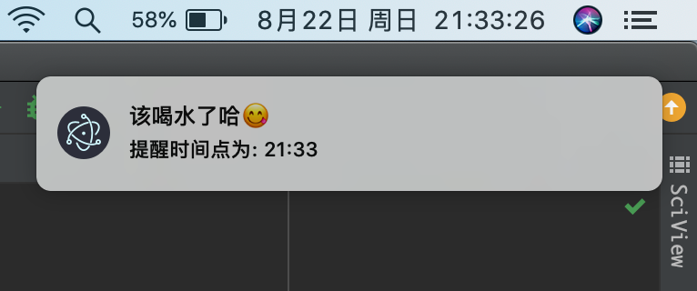
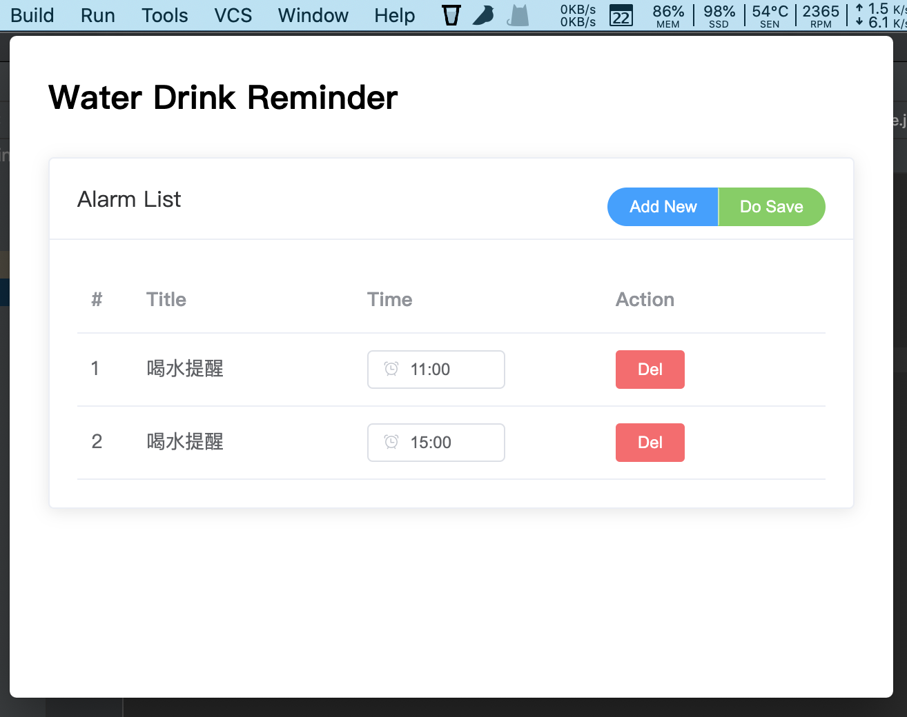

# Water Drink Reminder

> 基于环信MQTT开发

---

### 简介

基于`vue`+`electron`开发

### 运行

```shell
# 安装依赖
npm install

# 本地运行
npm run start 

# App打包
npm run dist
```

```text
dist/
├── WaterDrinkReminder-0.0.1-mac.zip
├── WaterDrinkReminder-0.0.1.dmg
├── WaterDrinkReminder-0.0.1.dmg.blockmap
├── builder-debug.yml
├── builder-effective-config.yaml
├── latest-mac.yml
└── mac
```


## 效果展示





